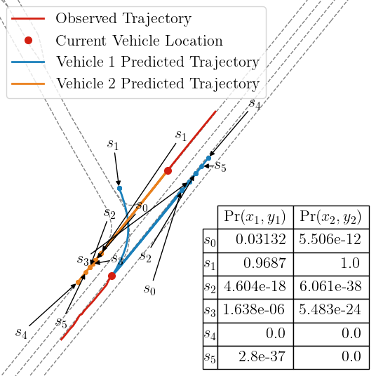

# mmTransformer

## Introduction

- Note, this repo is a **fork** from the original repo with added functionality to support **Multimodal Model Predictive Runtime Verification**.

- This repo is official implementation for [mmTransformer](https://github.com/decisionforce/mmTransformer) in pytorch. Currently, the core code of mmTransformer is implemented in the commercial project, we provide **inference code** of model with six trajectory propopals for your reference. 

- For other information, please refer to our paper **Multimodal Motion Prediction with Stacked Transformers**. (CVPR 2021) [[Paper](https://arxiv.org/pdf/2103.11624.pdf)] [[Webpage](https://decisionforce.github.io/mmTransformer/)]


## Preparation

### Download the code, model and data

1. Clone this repo from the GitHub.

        git clone https://github.com/decisionforce/mmTransformer.git

### Set up your virtual environment

- Initialize virtual environment:

      conda create -n mmTrans python=3.7
      conda activate mmTrans

- Argoverse API is already installed in the /argoverse directory. Please refer to [this page](https://github.com/argoai/argoverse-api) for full open source code.

- Install [pytorch](https://pytorch.org/) utilizing the following commands. The latest codes are tested on Ubuntu 16.04, CUDA11.1, PyTorch 1.8 and Python 3.7:
  (Note that we require the version of torch >= 1.5.0 for testing with pretrained model)

If machine equipped with CUDA 11.1 (adjust for other versions of CUDA):

      pip install torch==1.8.0+cu111\
            torchvision==0.9.0+cu111\
            torchaudio==0.8.0 -f https://download.pytorch.org/whl/torch_stable.html
otherwise:

      pip install torch==1.8.0\
            torchvision==0.9.0\
            torchaudio==0.8.0 -f https://download.pytorch.org/whl/torch_stable.html

- For other requirements, please install with following command:

      pip install -r requirement.txt

### Preprocess the dataset (Not Required)

The preprocessed dataset for the AGENT and AV are already included in the repo. Alternatively, you can process the data from scratch using following commands.

1. Download the Argoverse validation dataset [here](https://www.argoverse.org/av1.html#download-link) (should be downloaded as forecasting_val_v1.1.tar.gz) and save it to `./data`.

        cd data
        tar xvf forecasting_val_v1.1.tar.gz

2. Then extract the agent and map information from raw data via Argoverse API:

        python -m lib.dataset.argoverse_convertor ./config/demo.py

3. Finally, your directory structure should look something like something like this:

        mmTransformer
        └── models
            └── demo.pt
        └── interm_data
            └── AGENT
                └── argoverse_info_val.pkl
                └── map.pkl
            └── AV
                └── argoverse_info_val.pkl
                └── map.pkl

* Note this preprocesses for AGENT only. Change to AV in the various preprocessing utils and in config/demo.py to preprocess the AV.

Format of processed data in ‘argoverse_info_val.pkl’:


Format of map information in ‘map.pkl’:


## Run the mmTransformer

Run model to obtain results for AGENT:

    python Evaluation.py ./config/demo.py --model-name demo --vehicle AGENT

Run model to obtain results for AV:

    python Evaluation.py ./config/demo.py --model-name demo --vehicle AV

Results are stored in the following directory stucture

        mmTransformer
        └── data
            └── results
                └── AV
                └── AGENT
        └── latency.csv

## Results

Here we showcase the expected results on validation set for AGENT:

| Model | Expected results | Results in paper
|--|--|--|
| minADE | 0.709 | 0.713 |
| minFDE | 1.081 | 1.153 |
| MR (K=6) | 10.2 | 10.6 |

## Visualize

1. Download the Argoverse validation dataset [here](https://www.argoverse.org/av1.html#download-link) (should be downloaded as forecasting_val_v1.1.tar.gz) and save it to `./data` (if you haven't done so already).

        cd data
        tar xvf forecasting_val_v1.1.tar.gz

2. To re-create the image below, run the following (Latex install is required):

    python DisplayData.py



3. One can visualize other scenes by adjusting DisplayData.py.

## Citation
If you find our work useful for your research, please consider citing the paper
```
@article{liu2021multimodal,
  title={Multimodal Motion Prediction with Stacked Transformers},
  author={Liu, Yicheng and Zhang, Jinghuai and Fang, Liangji and Jiang, Qinhong and Zhou, Bolei},
  journal={Computer Vision and Pattern Recognition},
  year={2021}
}
```
